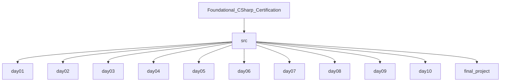

# Foundational_CSharp_Certification
Foundational_CSharp_Certification
📚 Resources
A curated set of official learning materials used throughout this 2‑week C# fast‑track:

Foundational C# Certification (freeCodeCamp + Microsoft)  
https://www.freecodecamp.org/learn/foundational-c-sharp-with-microsoft/ (freecodecamp.org in Bing)

Microsoft Learn — C# Collection  
https://learn.microsoft.com/en-us/collections/yz26f8y64n7k07

Microsoft .NET Blog — Certification Announcement  
https://devblogs.microsoft.com/dotnet/announcing-foundational-csharp-certification/ (devblogs.microsoft.com in Bing)


2‑Week Fast‑Track Plan
Week 1 — Core C# Fundamentals

Day 1: Environment setup, .NET CLI basics, first console programs

Day 2: Variables, data types, operators, string interpolation

Day 3: Conditionals (if/else, switch, pattern matching)

Day 4: Loops (for, foreach, while, do) and iteration patterns

Day 5: Methods, parameters, named/optional args, expression‑bodied members

Day 6: Collections (arrays, lists, dictionaries) and LINQ basics

Day 7: Mini‑project combining input, branching, loops, collections, and LINQ

Week 2 — Object‑Oriented + Modern C#
Day 8: Classes, objects, fields, properties, constructors

Day 9: Inheritance, polymorphism, interfaces, virtual/override patterns

Day 10: Exception handling, custom exceptions, defensive coding

Day 11: File I/O, JSON serialization/deserialization, persistence basics

Day 12: Modern C# features — async/await, Tasks, records, pattern matching, nullability

Day 13: Final certification project (classes, collections, file I/O, async)

Day 14: Review, polish, and certification submission

## Project Structure

The repository organizes daily exercises and the final project under `src`:

```
src/
	day01/
	day02/
	day03/
	day04/
	day05/
	day06/
	day07/
	day08/
	day09/
	day10/
	final_project/
```

Mermaid diagram of the layout:



To add more days, create additional `src/dayNN` folders (e.g., `day11`, `day12`, …) following the same pattern.
